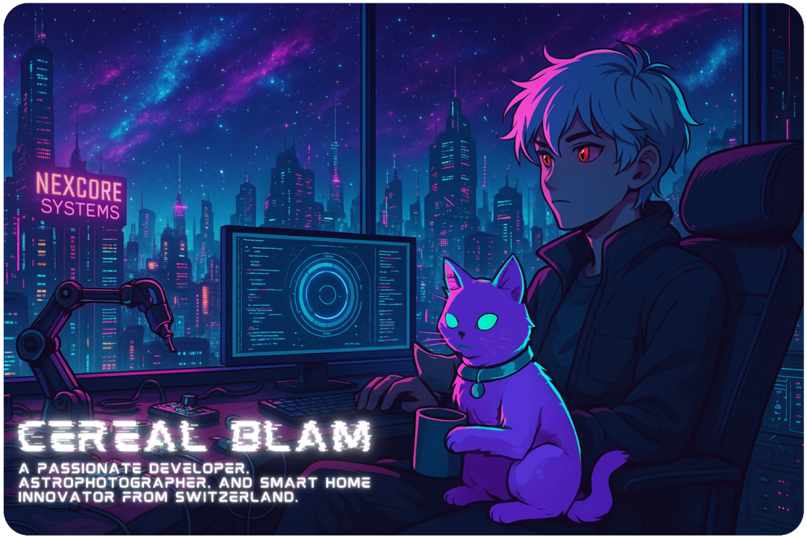

  

---

  

---

<h3 align="left">🧑‍💻 About Me:</h3>
<ul>
   <li>
    
    Building <strong>Nexcore</strong>, an AI-powered Smart Home Assistant.
  </li>
  <li>
  
  Focused on <strong>Smart Home Automation</strong> and IoT solutions.
  </li>
  <li>
    
    Passionate about <strong>physics</strong>, particularly <em>thermodynamics</em> and <em>astrophysics</em>.
  </li>
  <li>
    
    Interested in <strong>sustainable technology</strong> and energy-efficient systems.
  </li>
  <li>
    
    Enthusiastic about <strong>robotics</strong> and <strong>electrical engineering</strong>, working on automation and control systems.
  </li>
  <li>
    
    Currently exploring <strong>machine learning</strong> for automation and AI-driven applications.
  </li>
</ul>

---

<h3 align="left">📬 Connect with Me:</h3>

  
  <!-- Discord -->
  

  <!-- Instagram -->
  

  <!-- Reddit -->
  

  <!-- Twitch -->
  

  <!-- YouTube -->
  

  <!-- Steam -->
  

  <!-- Patreon -->
  

  <!-- Ko-Fi -->
  

  <!-- Postman -->
  

---

---
<h3 align="left">🛠️ Technologies and Tools:</h3>

<h4>🔹 Programming Languages:</h4>

  

<h4>🔹 Frameworks & Libraries:</h4>

  
<a href="https://angularjs.org/" target="_blank" rel="noreferrer">
    

  
  

  

  
<h4>🔹 Databases:</h4>

  

<h4>🔹 Tools & Technologies:</h4>

  

  
  

<h4>🔹 IDEs & Development Environments:</h4>

  

<h4>🔹 Web Technologies:</h4>

  

<h4>🔹 Operating Systems:</h4>

  
  

<h4>🔸 AI & NLP:</h4>

  

  
  

 
  
  

<h4>🔸 Automation & IoT:</h4>

  
  
  

<h4>🔸 Network & Security:</h4>

   
  
  
  
  

<h4>🔸 Development & Debugging:</h4>

  
  
  
  
  

---

<h3 align="left">📊 GitHub Stats:</h3>

  
  

  

  

---

<h3 align="left">🚀 Projects:</h3>
<ul>
  <li>
    
    <strong>Nexcore</strong>: AI-powered Smart Home Assistant
  </li>
  <li>
    
    <strong>Smart Mirror</strong>: Intelligent home interface
  </li>
  <li>
    
    <strong>Robotics</strong>: Learning Robotic systems
  </li>
  <li>
    
    <strong>Space Commander</strong>: Discord Space Server Bot
  </li>
  <li>
    
    <strong>Space Website</strong>: Discord Space Bot
  </li>
  <li>
    
    <strong>Personal Website</strong>: About me website
  </li>
  <li>
    
    <strong>Space Cat</strong>: A cosmic bot exploring the galaxies of servers
  </li>
</ul>

---

  

